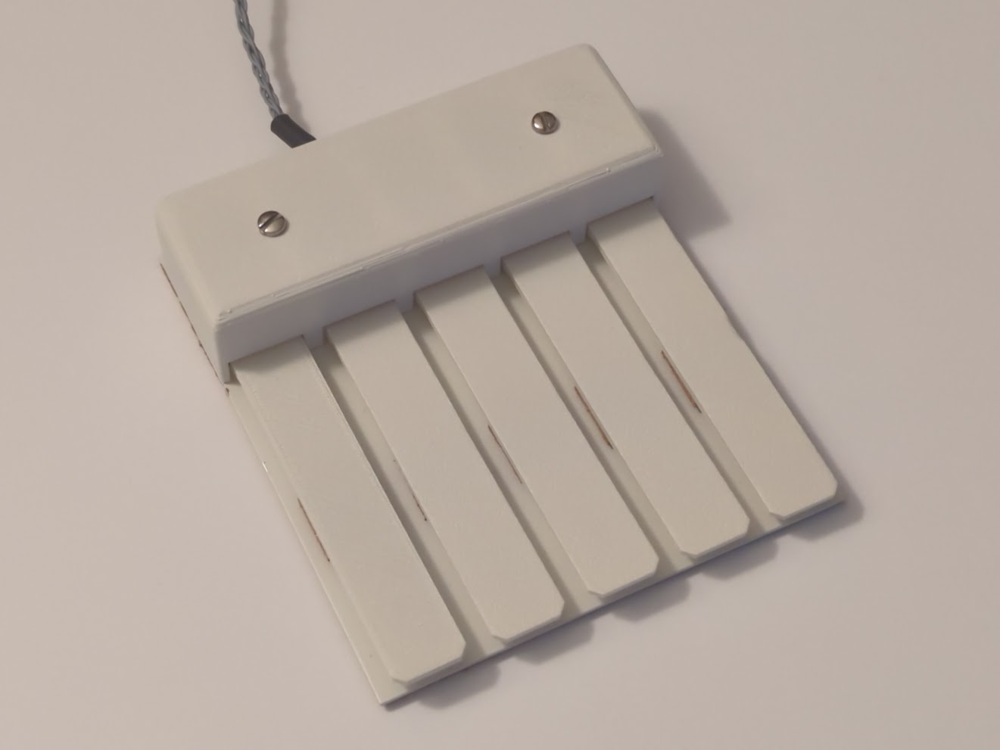
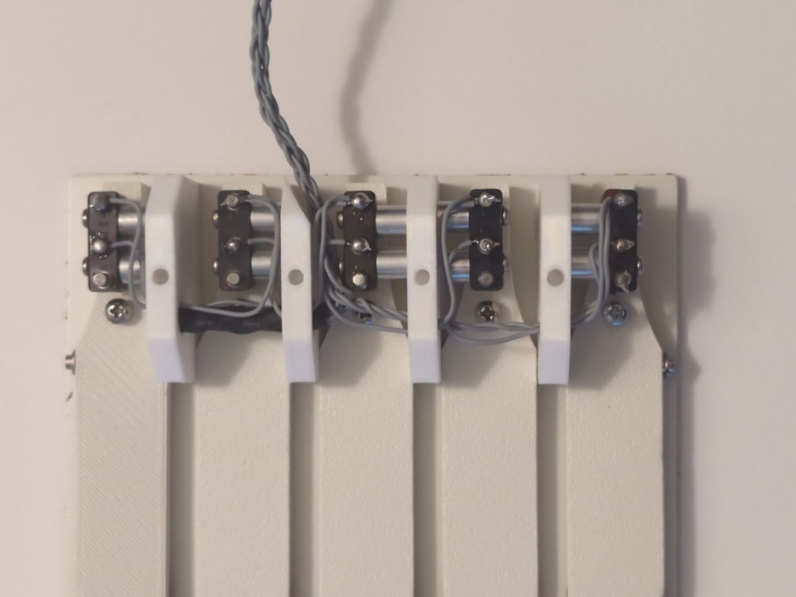
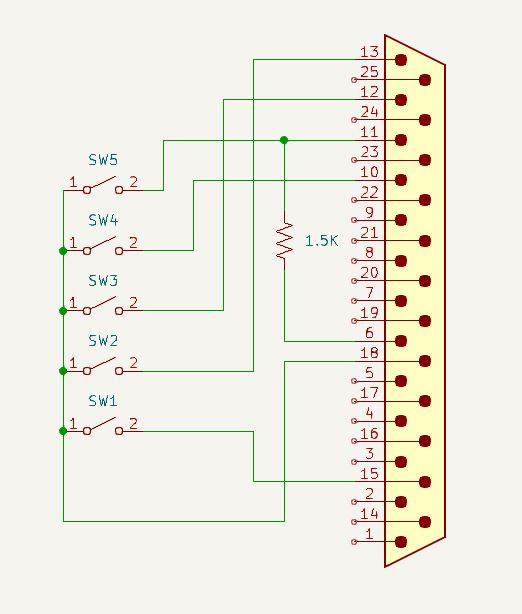

# Reproduction Engelbart Keyset

The computer mouse was one of several remarkable innovations created by Douglas
Engelbart and his team at SRI back in the 1960s. Although nearly everyone is familiar
with the mouse, which is typically used by the dominant hand, few people are familiar
with the input device they developed for the non-dominant hand. It is called a
keyset (or sometimes, a chord keyboard).

For details about the history of the device, Ken Shirriff has an [excellent blog post](https://www.righto.com/2025/03/mother-of-all-demos-usb-keyset-interface.html).

I made some measurements of the keyset Ken had on loan and 3D-printed a replica.
With these files, you can print one for yourself as well!

## Bill of Materials

| Q | Part | Description |
|---|------|-------------|
| 1 | Base plate | 16-gauge steel base plate. [Drawing PDF](mech/basemetal.pdf) |
| 1 | Base plate cork pad | 2mm cork pad, self-adhesive. [Drawing PDF](mech/corkbase.pdf) |
| 3 | Pillow block | [STL file](mech/pillowblock.stl) |
| 1 | Pillow block (corner trimmed) | [STL file](mech/pillowblockcut.stl) |
| 5 | Key | [STL file](mech/key.stl) |
| 5 | Key cushion, cork | 2mm cork, self-adhesive, cut into a 3/4" square |
| 1 | Cover | [STL file](mech/cover.stl) |
| 10 | Standoff, round, 1/4" diameter, 1/4" length, not threaded | Switch mounting standoffs |
| 10 | Screw, pan head phillips, 2-56 x 5/8" | Screws to mount switches to pillow blocks |
| 5 | Switch, SPDT, Micro Switch 1SM2 or equiv, 141g actuation force. | Switch. Can substitute E-Switch MS0850500F130S1A. |
| 10 | Screw, pan head phillips, 4-40 x 3/8" | Adjustment screws for keys, two each |
| 10 | Screw, pan head phillips, 4-40 x 5/16" | Pillow block mounting screws, two each |
| 2 | Screw, pan head slotted, 6-32 x 1/4", 0.27" head diameter | Cover mounting screws |
| 1 | Steel pivot rod, 1/8" diameter, 4 15/16" long | Shaft pivot for keys |
| 2 | Retaining ring, E-style, 1/8" diameter, 0.02" wide | Retaining rings for steel rod |
| 1 | 6-conductor cable | 26-gauge conductors, grey |
| 2 | Heat shrink tubing, 1/4" diameter, 1.5" long | Strain relief for cable |
| 1 | DB25 male plug | For parallel port version |
| 1 | 1.5K ohm resistor, 1/4 watt | For parallel port version |
| 1 | DB25 hood | For parallel port version |

## 3D Printing

I used an Ender 3 with a 0.4mm nozzle and white PLA filament for the 3D-printed
parts. A textured bed is optional but you will get a nicer finish on the keys
this way. The keys may warp after printing, but you can correct this with a
hair dryer and a little force.

For an extra nice touch, consider painting the keys and the top cover. 
The usual approach is to use a filling primer, then sand the part, then paint
again, repeating until the "lines" disappear. Then apply a final coat. Use
an off-white paint to match the original color.

You can tap the screw holes on the parts to make it easier to thread the screws
through them, or you can just thread the machines screws directly into the
part.

* Keys: two 4-40
* Pillow blocks: two 2-56, two 4-40, one 6-32

## Metal Base Plate

The base plate is made of a piece of 16-gauge sheet steel. I like to use a
sheet metal hand punch to make the holes, but you can drill them if you like.
Use a center punch to prevent your drill bit from wandering. A center punch
divot is helpful to locate the hand punch die if you opt for that approach.

The base plate should be primed and painted as well.

## Cork

A piece of adhesive-backed cork should be attached to the base plate after
the paint has dried. The holes in the cork can be made with a sheet metal
hand punch, but a paper hole punch should give good results as well.

Don't forget to cut out the 5 squares of cork used to cushion the keys.
The cork squares should be mounted about 1.5" from the ends of the keys
on the underside. Do this before installing the keys in the keyset.

## Steel Pivot Rod

The pivot rod can be cut to length with a rotary tool or hacksaw. Ideally
you should use it with retaining rings which require grooves to be cut.
You could do this with a lathe, or by putting it in the chuck of a drill
press and using a file to cut the grooves. For mine, I press-fit two
split-ring lock washers instead.

## Assembly

It's easiest to attach the switches to the pillow block pieces before
mounting them to the base plate. When viewed from the top, the leftmost
pillow block has a switch mounted on the left side. The 2nd-leftmost
pillow block is the special one with the trimmed corner to allow for
the cable to pass through the hole in the back of the cover. It also
has a switch mounted on the left side.

The 2nd-to-rightmost pillow block has two switches mounted on it, one
on each side. The rightmost pillow block has a switch mounted on the right.

All switches should be positioned so the actuator button is towards the
rear of the keyset. The actuator button must line up with the rearmost hole
in the top of the key. Eventually there will be an adjustment screw here
that will push the actuator.

Now use 10x 4-40 screws to mount the pillow blocks to the base plate.
Leave them a little loose so you can insert the pivot rod in the next step.

Place the keys at the ends of and in between the pillow blocks so that there
are five in a row. The flat, textured side should be facing up. Install a
retaining ring at one end of the pivot ride. Slide the pivot rod in one end,
through all the pillow block and key pivot holes, out the other end, and
secure it with the other retaining ring. The keys should be free to move up
and down. Tighten down all ten screws that hold the pillow blocks in place.

Install 5x 4-40 screws on the top of the keys at the hole closest to the pivot
point. These screws adjust the position of the keys in their normal at-rest
position. Flip the keyset over and install 5x 4-40 screws into the keys through
the access holes in the base plate. These set the trigger points of the
switches.

To adjust the trigger point screws, push the key down and then tighten the
screw until you hear the switch click. Release the key and make sure the
switch disengages (making another click).

To adjust the rest-point screws, tighten the screw until you hear the switch
click, and then back it out a little until the switch clicks again. You
also want to make sure that all the keys line up visually while at rest.

The original keyset uses an unusual multi-conductor cable with no jacket. It
has six grey 26-gauge wires arranged into twisted pairs that are then twisted
together. One wire goes to the common connection of all the switches (the
rear terminal) while the remaining five wires are connected one to each
switch (center terminal).

There are two pieces of heat shrink tubing. One nestles in the 1/4" holes
in the pillow blocks and helps trap the cable in place. The other goes
between the cable and the hole in the top cover to act as a strain
relief.

Run the cable through the hole in the top cover and pull it all the way
through. The top cover should slip over the pillow blocks and sit flush
with the metal base plate. Install the two flat head screws to hold it
in place.

## Wiring

If you want to connect your keyswitch to a parallel port, the wiring diagram
is below. There is a 1.5K resistor (optional) used for presence detect.
Otherwise, just run the wires to your Teensy board. Ken Shirriff's blog
entry has more information.

